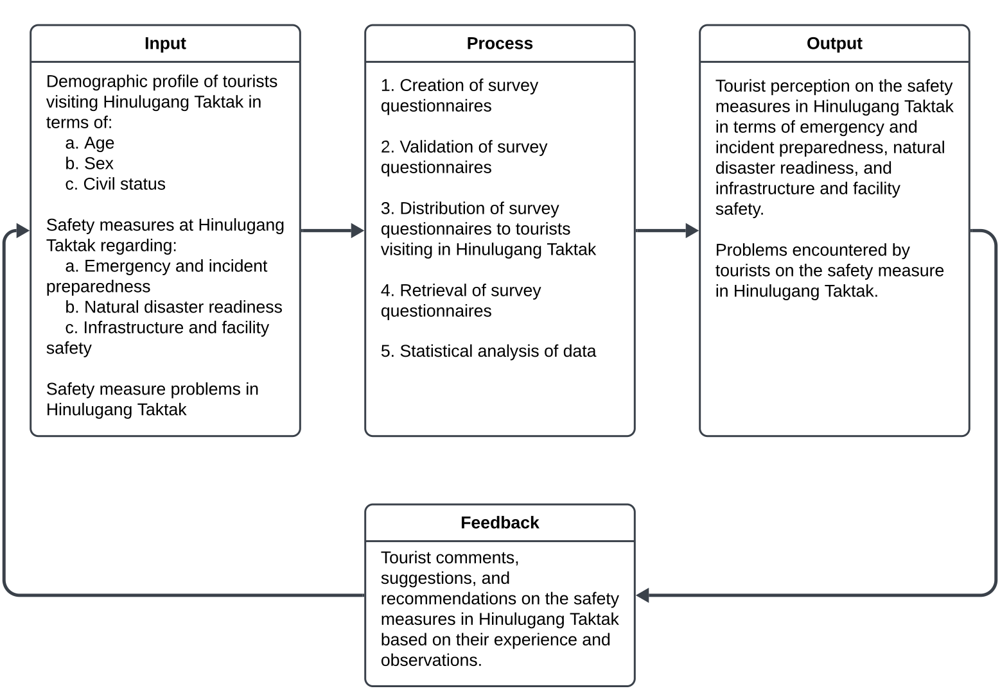

# Tourist Perception on the Implementation of Safety Measures in Hinulugang Taktak, Antipolo City: A Proposed Guidelines
## Researchers
Alapad, Erica A.  
Cal, John Alen C.  
Codal, Nikka L.  
Mora, Siena Mae Joy R.  
Silva, John Bernard S. 

*(December 2024)*
## Abstract
## Chapter 1: Introduction
This chapter includes the background of the study, related literature and studies, theoretical framework, conceptual framework, statement of the problem assumption, scope and delimitations of the study, significance of the study and definition of terms.
### Background of the Study
Tourism’s role in economic development is dependent on the tourists’ perceptions, attitudes, and experiences toward the destinations they visit, and these factors directly influence travel decisions and destination selection, making them critical for sustainable tourism growth [(Brida et al., 2020)](https://www.sciencedirect.com/science/article/abs/pii/S0261517720300571). One of the main considerations for tourists in choosing a travel destination is the perceived quality and implementation of safety measures. The presence of well-enforced safety protocols can enhance the appeal of a tourist site, boosting tourist confidence and repeat visits, which in turn strengthens the tourism sector.

Travelers are more inclined to avoid areas perceived as hazardous. This means that in high-risk tourist destinations, risk and safety management is important. Effective risk management helps strengthen a destination’s image by developing and implementing policies that promote safety, which in turn boosts the site’s brand equity and appeal. A well-maintained destination image is essential for attracting international and domestic tourists, as it reflects tourists’ collective perceptions, experiences, and evaluations of a location [(Mercado & Apritado, 2021)](https://research.lpubatangas.edu.ph/wp-content/uploads/2021/10/m7732_ijrsm_final.pdf).
Hinulugang Taktak Protected Landscape, a popular tourist destination in Antipolo City, Philippines, integrates tourism and conservation efforts. Known as a summer retreat where locals from nearby areas gather for recreation, this protected landscape benefits from its status under the Expanded National Integrated Protected Areas System (ENIPAS) Act, or Republic Act 11038 [(Congress of the Philippines, 2017)](https://legacy.senate.gov.ph/republic_acts/ra%2011038.pdf). However, several risks pose challenges to this attraction, such as infrastructure vulnerabilities and the presence of settlements along riverbanks that threaten the natural environment. Additionally, natural disasters, including earthquakes, landslides, and soil erosion, create ongoing safety concerns for visitors [(Eden, 2022)](https://haraya.upca.upd.edu.ph/wp-content/uploads/2022/07/Eden.pdf). This may harm the reputation of the landscape to both local and foreign visitors.

Therefore, it is critical to determine and assess effective safety measures given these threats to the landscape in the perspective of the tourist. Risk indicators for tourist destinations lead to the development of safety protocols in different aspects such as emergency response, natural disaster mitigation, infrastructure, and general safety guidelines. Emergency safety measures involve strategies for proactive incident response, including positioning security personnel and ensuring staff are well-trained to handle potential hazards [(Vaiagae, 2020)](https://scholarworks.waldenu.edu/dissertations/8342/). Natural disaster risk mitigation involves designated evacuation routes and safe zones within high-risk areas, while infrastructure safety measures address facility quality and accessibility to ensure a safe environment for visitors of all ages. General safety practices include placing warning signs and maintaining quality equipment to prevent accidents.

This study aims to assess tourist perceptions of safety measures at Hinulugang Taktak, focusing on emergency/incident response, natural disaster preparedness, infrastructure safety, and general safety protocols. Furthermore, it seeks to identify safety-related challenges experienced by visitors. Based on the findings, the study will propose guidelines to enhance the safety and reputation of Hinulugang Taktak, contributing to both the site’s long-term appeal and the broader knowledge of tourism safety management in the Philippines.
### Related Literature and Studies
#### Foreign
* 5 rrl
* 5 rrs
#### Local
* 5 rrl
* 5 rrs
### Theoretical Framework
This study uses the Theory of Planned Behavior (TPB) to determine tourist perceptions on safety measures at Hinulugang Taktak and explain how these perceptions influence their intention to visit. It is developed by Ajzen (1991) and is a widely recognized framework on psychology for understanding the relationship between individual’s perception, attitude, and behavior. It has three primary constructs namely: attitude, subjective norms, and perceived behavioral control that shapes an individual’s behavioral intentions and behavior as shown in Figure 1.

**Figure 1**  
*Theory of Planned Behavior*  

### Conceptual Framework
The study used the Input-Process-Output (IPO) model to outline key variables of the study. The IPO model comprises of three main phases: Input, Process, and Output as shown in Figure 2.

The Input consists of the demographic profile of the tourists visiting in Hinulugang Taktak in terms of age, sex, and civil status, and the safety measures in in terms of emergency and incident preparedness, natural disaster readiness, and infrastructure and facility safety.

The Process comprises the creation, validation, distribution, and retrieval of survey questionnaires. Statistical analysis of the gathered data is also included in the Process. 

The Output contains the tourist’s perception and problems encountered on the safety measure in Hinulugang Taktak.

The Feedback serves as a feedback loop from the Output to the In  put. It includes tourist comments, suggestions and recommendations on the safety measures in Hinulugang Taktak.

**Figure 2**  
*Input-Process-Output (IPO) Model for Tourist Perception on Safety Measures in Hinulugang Taktak*  

### Statement of the Problem
Tourism is considered as one of the driving force of national economy. However, the industry is dependent on a tourist's decision for selecting a travel destination. One of the factors that influence this decision is the tourist perception on the implementation of safety measures in the tourist spot. Because of this, there is a need to determine the assessment of safety measures from a tourist's perspective. To add, studies on safety measures at local tourist destinations in the Philippines remains limited.                             

The objective of this study is to fill this gap by determining tourist perceptions of safety measures at Hinulugang Taktak focusing on three key themes: emergency/incident preparedness, natural disaster readiness, infrastructure facility and safety. The study also aims to determine the problems encountered by tourists on the overall general safety measures of the place. By evaluating these areas, the study seeks to provide insights that can guide improvements in local safety standards, and in turn, enhance the site's reputation to both domestic and international tourists.

The study addresses the following research questions:  
1.	What is the socio-demographic profile of tourists visiting Hinulugang Taktak in terms of age and sex?
2.	What is the tourist perception on safety measures at Hinulugang Taktak regarding:
    1. Emergency and incident preparedness,
    2. Natural disaster readiness,
    3. Infrastructure and facility safety?
3.	What are the safety-measure problems do tourists encounter during their visit to Hinulugang Taktak?
4.	Based on the findings of the study, what are the proposed safety measure guidelines to strengthen safety protocols at Hinulugang Taktak?
### Assumption
Assumptions are conditions, or premises the researcher believes to be true without concrete proof for the study's purposes. These are facts or events a researcher assumes true without verification from a researcher. This study operates under the following assumptions:
1. The study assumes that all participants will answer the survey questionnaire honestly and to the best of their knowledge. The accuracy of findings is dependent on the truthful response since the study relies on self-reported data.
2. The study assumes that the survey instrument used in this study are reliable and valid for capturing tourists' perceptions of safety measures. The contents of the survey is based on established literature for accuracy on the measurement of the intended variables.
3. The study assumes that the tourists participating in this study have sufficient awareness and familiarity with the implemented safety measures at Hinulugang Taktak.
4. The study assumes that external factors such as weather conditions, local events, or sudden changes will not alter the conditions of Hinulugang Taktak during the study period.
### Scope and Delimitation of the Study
The scope of this study is limited to tourists visiting Hinulugang Taktak during the data collection period. Only tourists who have visited the location for the past month will be included to ensure relevance and accuracy in reporting their current perceptions. The study will gather data using survey questionnaires distributed to tourists at the site focusing on their experiences on the safety measures of the place.

The study is further confined to the following specific aspects:  
  1.	The study will only focus on safety measures related to emergency preparedness, natural disaster risks, and infrastructure, and will not explore other aspects of tourism management or the general tourism experience from Hinulugang Taktak.  
  2.	The study will only collect data from tourists aging 15 and above and is visiting the site during the study period.  
  3.	The study will only focus on Hinulugang Taktak in Antipolo City, excluding other nearby tourist spots or regions in the Philippines.

The delimitations of the study are as follows:  
  1.	The study does not include other tourist destinations within the nearby tourist spots, in the Philippines, or internationally as it only focuses on Hinulugang Taktak.  
  2.	The data collection method of this study is limited only to self-reported responses through surveys, whose report may be influenced by the respondent's biases or subjective interpretations.  
  3.	The sample size will be limited to a manageable number of respondents from the site due to resource constraints, which may not fully represent the broader population of tourists who visit Hinulugang Taktak.  

These delimitations is to maintain the feasibility of the study within the constraints of time and resources and its findings will be most applicable only to Hinulugang Taktak and may not be fully generalizable to other tourist destinations.
### Significance of the Study
The present study was significant to the LGU, Tourist, Stakeholder, Local Communities, Owner, and Future Researchers.

For the LGU: They can establish a positive reputation as a secure and safety that makes a destination more attractive to investors and developers. This may encourage additional spending on infrastructure associated with tourism including lodging facilities, resorts, transportation and recreational facilities. Investing in safety measure for tourists is not only to protect visitors but also yields significant economic, social and environmental benefits for local governments and communities.

For the Tourist: By implementing safety measure, it enhancing the tourist Satisfaction, providing peace of mind that can help tourist feel safer and enjoy their travel experience without worrying potential risks.

For the Stakeholder: Implementing safety measure make the stakeholders investments protected, making the destinations more attractive, promoting sustainable tourism, handling emergencies better and ensuring tourism industry thrives in the long run.

For the Local Communities: Tourist safety precautions improve general safety, build strong bonds with guests, and stimulate economic growth by creating jobs and increasing tourism-related revenue for local communities.

For the Owner: It benefits the owner in many ways it could be enhancing their reputation, attracting more visitors, reducing insurance cost, reducing liability risk, Increased competitive advantage, and long-term business sustainability, 

For the Future Researchers: They may use this study as a source of both conceptual and research literature when they conduct their own studies related to the topic of the present Study.
### Definition of Terms
The following terms are conceptually defined for the comprehension and understanding of the study.

Attraction. A place of interest where tourists visit, typically for its inherent or exhibited natural or cultural value, historical significance, natural or built beauty, offering leisure, adventure, and amusement.

Facilities. An establishment providing primarily for tourist accommodation or recreation, or both, and may include camp, caravan sites, holiday cabins, picnic grounds, playgrounds, and restaurants.

Guidelines. A set of rules or instructions that are given by an official organization telling you how to do something.

Operational. A practical implementation and execution of safety protocols and procedures.

Precautions. An action taken to prevent something unpleasant or dangerous from happening.

Safety measure. An action, procedure or contrivance designed to lower the occurrence or risk of injury, loss and danger to persons, property or the environment.

Stakeholder. Are individuals or organizations that have an interest in the tourism industry. They can be directly involved in the industry, such as tourism businesses or government agencies, or they can be indirectly involved, such as local communities or environmental groups.

Sustainable tourism. Tourism that takes full account of its current and future economic, social and environmental impacts, addressing the needs of visitors, the industry, the environment and host communities.

Tourists. A person who is traveling, especially for pleasure.
## Chapter 2: Methods 
### Research Design
The study used a descriptive research design to determine tourist perceptions on safety measures of Hinulugang Taktak. Descriptive research design is appropriate for this study because frequency, percentage, and weighted mean were used to assess the respondent's perception on the implementation of safety measures of the site. It is also supported by similar studies by Torralba and Ylagan (2021) on their measurement on perceived safety and security of resorts in Batangas. Using descriptive research in this study is appropriate for accurate description of the target population.
### Respondents of the Study
The respondents of this study are 50 tourist visitors of Hinulugang Taktak in Antipolo City aging 15 years old and above.
### Sampling Technique
The study used a type of non-probability sampling technique called purposive sampling where tourist visitors are specifically sampled out from the population due to nature of data that the study requires. It is an appropriate sampling technique since tourist perception is the only information required for this study and responses from external participants are not included. 
### Instrument Used in the Study
The instrument used in the study is a researcher-made survey questionnaire using a four-point Likert scale and a checklist. The instrument is based on the list of safety measures found in literature. It is composed of three parts: Part I is the demographic profile of respondents, Part II is the safety measure in Hinulugang Taktak, and Part III is the problems encountered by respondents regarding safety measure. Part I consists of the respondent's age, sex, and civil status. Part II consists and is based on the safety measures at Hinulugang Taktak in terms of incidents, natural disaster, and infrastructure and facility. Part III are problem indicators on the safety measures implemented in the site.

The questionnaire was intended to gather relevant and suitable information from respondents. Before it was utilized and delivered, the survey questionnaire's validity was verified by the research adviser and two specialists in the subject who were also from the academe and handling tourism management courses. Their feedback and recommendations were used to help enhance the questionnaire.
### Construction of the Questionnaire
The questionnaire is primarily based on the research question from the problem statement. Its content is from the synthesized safety measures from the literature. The researcher instruments are validated by research professionals, statisticians, and grammarians. The research professionals examine for the questionnaire's content and oversee its conformity with the issue statement, as stated in Chapter 1. On the other hand, the statistician will advise on how to apply statistical methods and models. Finally, for grammar usage, the researchers will seek the expertise of a language enthusiast as grammarian after all validations from the three different professionals and the questionnaire have been consolidated and approved by the researcher's advisor.
### Validation of the Instrument
For validation purposes, copies of the researchers' questionnaires were given to the thesis adviser, research expert, grammarian and statistician for correction, comments, and suggestions to ensure that all questions were relevant to the research problem; if all questions were relevant to the study, the questionnaire items were revised for greater clarity and definiteness. The researcher then personally handed the questionnaires to the respondents.
### Administration and Retrieval of the Questionnaires
In the administration and retrieval phase of the researcher-made questionnaire, the researchers will meticulously plan and execute the process with utmost attention to ethical considerations. The researcher's primary objective is to ensure all respondents' integrity, confidentiality, and voluntary participation while collecting the data for our study.

The researchers will seek ethical approval from the relevant institutional review board or ethics committee to commence the administration phase. This approval process will involve submitting detailed documentation outlining the purpose of the study, the nature of the questionnaire, and the steps taken to protect participant rights. Upon receiving approval, the researchers will proceed with recruiting participants, adhering to ethical guidelines, and obtaining informed consent from each individual before participating.

During the administration of the questionnaire, the researchers will prioritize clarity and accessibility to ensure that respondents fully understand the instructions and items presented to them. Any potential risks or discomfort associated with participation will be minimized through clear communication and the provision of support services if needed. Additionally, the researchers will assure respondents of the confidentiality and anonymity of their responses, emphasizing the researchers' commitment to protecting their privacy throughout the research process.

Once the questionnaire has been completed by participants, the researchers will initiate the retrieval phase, ensuring the secure collection and storage of all data collected. To maintain confidentiality, the researchers will utilize secure data storage systems and encryption protocols to safeguard participant information from unauthorized access or disclosure. Any identifying information collected will be kept separate from the questionnaire responses to protect participant anonymity.

Throughout the administration and retrieval process, the researchers will remain vigilant in upholding ethical principles and addressing any ethical concerns. The researchers will maintain open communication with participants, allowing them to withdraw from the study at any time without repercussion. Additionally, the researchers will regularly review and update our ethical protocols in response to feedback or unforeseen circumstances to ensure ongoing compliance with ethical standards.

This document certifies that the purpose of this study is to determine the tourist safety measure of Hinulugang Taktak, Antipolo city, which serves as a practical measure for a destination towards sustainability as part of the partial fulfillment of the requirements for the degree of Bachelor of Science in Tourism Management. The researchers assured the respondents that the information would be treated with the outmost confidentiality. In accordance with R.A 10173, the DATA Privacy Act of 2012,” Including its Implementing Rules and Regulations (IRR) as well as all other guidelines and issuance by the National Privacy Commission (NPC). The respondents signed a consent form as proof of their willingness to cooperate and that they were not force in any way.
### Statistical Treatment of Data

## Chapter 3: Results
### Problem 1
### Problem 2
### Problem 3

## Chapter 4: Discussion
### Summary of findings 
### Conclusions
### Recommendations
### Proposed Output

## References